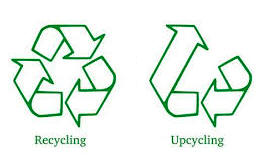
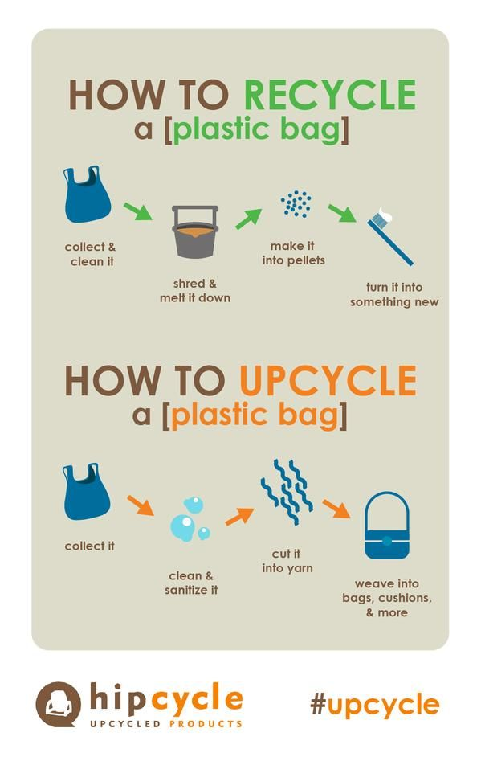

# {{ page.title }}

| Recycling | Upcycling |
|---------|---------|
| Recycling is turning waste to reusable materials. | Upcycling is using or modifying the same material for a different purpose. |
| Items like paper, glass, metal, and plastics can be recycled to make other items of the same material. | Items like cloth, paper, glass, metal, and plastics can be upcycled.
| For example, recycled paper, recycled plastic packaging | For example, decorating an empty wine bottle and adding a string of rice lights to use it as a night stand lamp. |
| Recycling requires a lot of water and energy to clean, breakdown and convert materials. | Upcycling does not require as much resources as recycling. |
| Recycling is usually done at specialized facilities. | Upcycling can be easily done at home also. |

The following illustration from Hipcycle explains this difference.

image credit: [Hipcycle](https://www.pinterest.pt/pin/514888169894564082/)

EarthHero also explains this difference through their article [Upcycling vs. Recycling](https://earthhero.com/upcycling-vs-recycling).

## See Also

 - [Benefits of Upcycling](./benefits)
 - [Inspiring Upcycle Ideas](./inspirations)
 - [Source of Materials](./sources)
  
